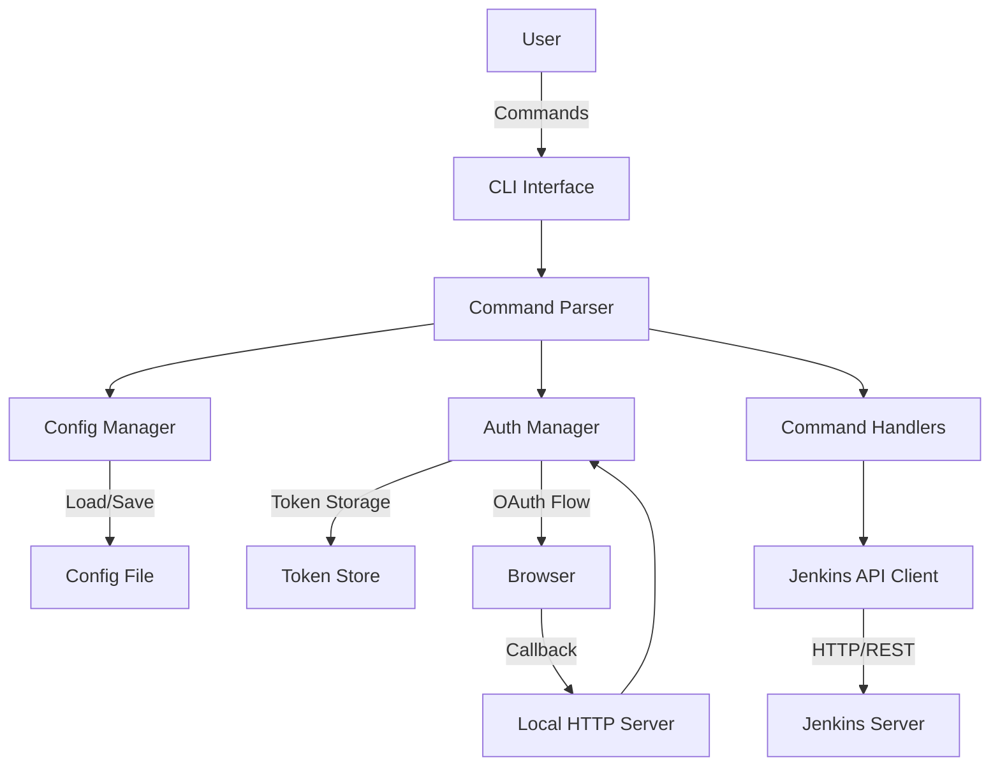
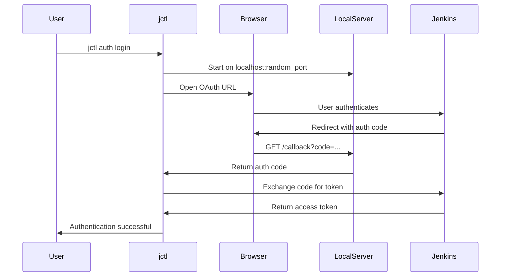

# Design Document: jctl (Jenkins Control Tool)

## Overview

jctl is a command-line interface tool for interacting with Jenkins CI/CD servers. The tool provides developers with terminal-based access to common Jenkins operations including pipeline management, build monitoring, log viewing, and build triggering. The design emphasizes simplicity, security through browser-based OAuth authentication, and flexibility through configuration file support.

The tool follows standard CLI conventions and patterns, using a command-subcommand structure similar to tools like `git`, `docker`, and `kubectl`. Authentication is handled through Jenkins API tokens or browser-based OAuth flows, with credentials securely stored for subsequent use.

## Architecture

### High-Level Architecture



### Component Layers

1. **CLI Interface Layer**: Handles command-line argument parsing, help text generation, and user interaction
2. **Configuration Layer**: Manages loading, validation, and merging of configuration from files and command-line options
3. **Authentication Layer**: Handles OAuth flows, API token management, and credential storage
4. **Command Layer**: Implements business logic for each command (list, logs, trigger, etc.)
5. **API Client Layer**: Provides a clean interface to Jenkins REST API endpoints
6. **Transport Layer**: Handles HTTP communication, error handling, and retries

## Components and Interfaces

### CLI Interface

The CLI interface uses a command-subcommand pattern:

```
jctl <command> [subcommand] [options] [arguments]
```

**Core Commands:**
- `jctl pipelines list` - List all pipelines
- `jctl builds list <pipeline>` - List builds for a pipeline
- `jctl logs <pipeline> <build-number> [--follow]` - View build logs (with optional streaming)
- `jctl trigger <pipeline> [--param key=value ...] [--follow]` - Trigger a build (with optional log streaming)
- `jctl auth login` - Initiate browser-based authentication
- `jctl profile list` - List all configured profiles
- `jctl profile show [profile-name]` - Show profile configuration
- `jctl profile set-default <profile-name>` - Set default profile
- `jctl config show` - Display current configuration
- `jctl --version` - Show version information
- `jctl --help` - Show help information

**Global Options:**
- `--profile <name>` - Use specific profile
- `--jenkins-url <url>` - Override Jenkins server URL
- `--config <path>` - Specify alternate config file
- `--output <format>` - Output format (text, json, yaml)
- `--verbose` - Enable verbose logging

**Command-Specific Options:**
- `--follow` / `-f` - Follow log output for running builds (logs and trigger commands)

### Configuration Manager

**Responsibilities:**
- Load configuration from file (YAML format)
- Manage multiple profiles (named configuration sets)
- Validate configuration values
- Merge configuration sources (file, environment variables, CLI flags)
- Provide configuration to other components

**Configuration File Structure:**
```yaml
# Default profile to use when --profile is not specified
default_profile: production

# Named profiles for different Jenkins instances
profiles:
  development:
    jenkins:
      url: https://jenkins-dev.example.com
      timeout: 30s
    auth:
      method: token
    output:
      format: text
      color: true
    defaults:
      pipeline: my-dev-pipeline
  
  staging:
    jenkins:
      url: https://jenkins-staging.example.com
      timeout: 30s
    auth:
      method: oauth
    output:
      format: json
      color: false
  
  production:
    jenkins:
      url: https://jenkins.example.com
      timeout: 60s
    auth:
      method: token
    output:
      format: text
      color: true
```

**Credentials Storage:**
Credentials are stored separately per profile in `~/.jctl/credentials`:
```yaml
profiles:
  development:
    token: dev-token-here
    username: dev-user
  staging:
    token: staging-token-here
    username: staging-user
  production:
    token: prod-token-here
    username: prod-user
```

**Configuration Precedence (highest to lowest):**
1. Command-line flags (--jenkins-url, etc.)
2. Environment variables (JCTL_PROFILE, JCTL_*)
3. Profile-specific configuration
4. Built-in defaults

**Interface:**
```
Config:
  - Load(path: string) -> Result<Config, Error>
  - GetProfile(name: string) -> Result<Profile, Error>
  - ListProfiles() -> []string
  - GetDefaultProfile() -> string
  - SetDefaultProfile(name: string) -> Result<void, Error>
  - Get(key: string) -> Value
  - Validate() -> Result<void, ValidationError>
  - Merge(other: Config) -> Config

Profile:
  - Name: string
  - JenkinsURL: string
  - Timeout: Duration
  - AuthMethod: string
  - OutputFormat: string
  - ColorEnabled: bool
  - Defaults: map[string]string
```

### Authentication Manager

**Responsibilities:**
- Manage authentication tokens per profile
- Implement OAuth browser flow
- Store and retrieve credentials securely per profile
- Validate token expiration

**Authentication Methods:**

1. **API Token Authentication** (Primary method)
   - User generates token from Jenkins UI
   - Token stored per profile in `~/.jctl/credentials` file
   - Token sent in HTTP Authorization header

2. **Browser OAuth Flow** (For OAuth-enabled Jenkins)
   - Start local HTTP server on random port
   - Open browser to Jenkins OAuth endpoint with callback URL
   - Receive authorization code via callback
   - Exchange code for access token
   - Store token for current profile

**Credentials File Structure:**
```yaml
profiles:
  development:
    token: <encrypted-or-plain-token>
    username: dev-user
    expires_at: 0  # 0 for non-expiring tokens
  production:
    token: <encrypted-or-plain-token>
    username: prod-user
    expires_at: 1735689600  # Unix timestamp
```

**OAuth Flow Sequence:**


**Interface:**
```
AuthManager:
  - Login(profile: string) -> Result<Token, Error>
  - GetToken(profile: string) -> Result<Token, Error>
  - ValidateToken(profile: string, token: Token) -> Result<bool, Error>
  - StoreToken(profile: string, token: Token) -> Result<void, Error>
  - ClearToken(profile: string) -> Result<void, Error>
  - ListProfiles() -> []string
```

### Command Handlers

Each command has a dedicated handler that implements the business logic.

**PipelinesListHandler:**
- Calls Jenkins API to retrieve all jobs
- Filters and formats pipeline information
- Outputs results in requested format

**BuildsListHandler:**
- Validates pipeline name exists
- Retrieves build history for specified pipeline
- Formats build information (number, status, timestamp, duration)
- Handles pagination if needed

**LogsHandler:**
- Validates pipeline and build number exist
- Retrieves console output from Jenkins API
- Streams output to stdout
- Handles in-progress builds (partial logs)
- When --follow flag is set:
  - Continuously polls Jenkins API for new log content
  - Displays new log lines as they become available
  - Tracks byte offset to avoid re-displaying content
  - Detects pending input steps
  - Prompts user for input when input step is detected
  - Submits input to Jenkins and continues streaming
  - Exits when build completes or user interrupts (Ctrl+C)

**TriggerHandler:**
- Validates pipeline exists
- Parses build parameters from command line
- Validates required parameters are provided
- Triggers build via Jenkins API
- Returns build queue information or build number
- When --follow flag is set:
  - Waits for build to start (polls queue item)
  - Once build starts, retrieves build number
  - Streams build logs progressively until completion
  - Detects and handles input steps interactively
  - Displays final build status (SUCCESS, FAILURE, etc.)

**ProfileListHandler:**
- Retrieves all configured profiles from config manager
- Displays profile names with their Jenkins URLs
- Indicates which profile is the default
- Formats output based on --output flag

**ProfileShowHandler:**
- Retrieves specified profile configuration
- Displays all profile settings (URL, timeout, auth method, etc.)
- Shows whether credentials are configured for the profile
- Handles non-existent profile error

**ProfileSetDefaultHandler:**
- Validates profile exists
- Updates default_profile in config file
- Displays confirmation message

**Interface Pattern:**
```
CommandHandler:
  - Execute(args: Arguments, config: Config, client: APIClient) -> Result<Output, Error>
  - Validate(args: Arguments) -> Result<void, ValidationError>
```

### Jenkins API Client

**Responsibilities:**
- Provide clean interface to Jenkins REST API
- Handle authentication headers
- Parse JSON responses
- Handle API errors and translate to user-friendly messages

**Key Endpoints Used:**
- `GET /api/json` - Get Jenkins instance info
- `GET /api/json?tree=jobs[name,url,color]` - List all jobs
- `GET /job/{name}/api/json` - Get job details
- `GET /job/{name}/api/json?tree=builds[number,result,timestamp,duration]` - List builds
- `GET /job/{name}/{number}/consoleText` - Get build logs
- `GET /job/{name}/{number}/logText/progressiveText?start=N` - Get progressive logs from byte offset N
- `POST /job/{name}/build` - Trigger build without parameters
- `POST /job/{name}/buildWithParameters` - Trigger build with parameters
- `GET /job/{name}/{number}/api/json` - Get build details
- `GET /queue/item/{id}/api/json` - Get queue item status
- `GET /job/{name}/{number}/wfapi/describe` - Get workflow execution details (includes pending inputs)
- `POST /job/{name}/{number}/input/{inputId}/submit` - Submit input for approval step
- `POST /job/{name}/{number}/input/{inputId}/abort` - Abort input step

**Interface:**
```
JenkinsClient:
  - New(baseURL: string, auth: AuthManager) -> JenkinsClient
  - ListJobs() -> Result<[]Job, Error>
  - GetJob(name: string) -> Result<Job, Error>
  - ListBuilds(jobName: string) -> Result<[]Build, Error>
  - GetBuildLog(jobName: string, buildNumber: int) -> Result<string, Error>
  - GetProgressiveLog(jobName: string, buildNumber: int, startByte: int) -> Result<ProgressiveLogResponse, Error>
  - TriggerBuild(jobName: string, params: Map<string, string>) -> Result<QueueItem, Error>
  - GetBuildInfo(jobName: string, buildNumber: int) -> Result<Build, Error>
  - GetQueueItem(queueID: int) -> Result<QueueItem, Error>
  - GetPendingInputs(jobName: string, buildNumber: int) -> Result<[]InputStep, Error>
  - SubmitInput(jobName: string, buildNumber: int, inputID: string, params: Map<string, string>) -> Result<void, Error>
  - AbortInput(jobName: string, buildNumber: int, inputID: string) -> Result<void, Error>
```

**Progressive Log Streaming:**

The progressive log feature uses Jenkins' `progressiveText` API endpoint which returns:
- New log content since the last request
- `X-Text-Size` header indicating the current byte offset
- `X-More-Data` header indicating if build is still running

**Streaming Algorithm:**
1. Start with byte offset 0
2. Request logs from current offset: `GET /job/{name}/{number}/logText/progressiveText?start={offset}`
3. Display returned log content
4. Update offset from `X-Text-Size` header
5. Check `X-More-Data` header:
   - If "true": wait 1-2 seconds, goto step 2
   - If "false": build complete, exit
6. Handle user interrupt (Ctrl+C) gracefully

**Input Step Handling:**

When following logs, jctl periodically checks for pending input steps:

1. Poll workflow API: `GET /job/{name}/{number}/wfapi/describe`
2. Check for `pendingInputActions` in response
3. If input detected:
   - Display input message/prompt to user
   - For simple approval: prompt "Proceed? (y/n)"
   - For parameterized input: prompt for each parameter
   - Read user input from stdin
   - Submit via: `POST /job/{name}/{number}/input/{inputId}/submit` with parameters
   - Continue log streaming
4. If user types "abort" or Ctrl+C: call abort endpoint

## Data Models

### Job (Pipeline)
```
Job:
  - name: string
  - url: string
  - description: string
  - buildable: bool
  - color: string  // Indicates status (blue, red, yellow, etc.)
  - lastBuild: BuildReference
```

### Build
```
Build:
  - number: int
  - url: string
  - result: string  // SUCCESS, FAILURE, ABORTED, UNSTABLE, null (in progress)
  - timestamp: int64  // Unix timestamp in milliseconds
  - duration: int64   // Duration in milliseconds
  - building: bool
  - parameters: []Parameter
```

### Parameter
```
Parameter:
  - name: string
  - value: string
  - type: string  // StringParameter, BooleanParameter, ChoiceParameter, etc.
```

### QueueItem
```
QueueItem:
  - id: int
  - task: TaskReference
  - why: string  // Reason for queuing
  - blocked: bool
  - buildable: bool
  - executable: ExecutableReference  // Present when build starts
```

### ProgressiveLogResponse
```
ProgressiveLogResponse:
  - content: string  // New log content since last request
  - nextOffset: int64  // Byte offset for next request (from X-Text-Size header)
  - hasMoreData: bool  // Whether build is still running (from X-More-Data header)
```

### InputStep
```
InputStep:
  - id: string  // Unique identifier for this input step
  - message: string  // Prompt message to display to user
  - ok: string  // Text for approval button (e.g., "Proceed", "Deploy")
  - abort: string  // Text for abort button (e.g., "Abort", "Cancel")
  - parameters: []InputParameter  // Parameters required for this input
```

### InputParameter
```
InputParameter:
  - name: string
  - description: string
  - type: string  // "string", "boolean", "choice", "password"
  - defaultValue: string
  - choices: []string  // For choice type parameters
```

### Token
```
Token:
  - value: string
  - type: string  // "api_token" or "oauth"
  - expiresAt: int64  // Unix timestamp, 0 for non-expiring tokens
  - username: string
```

### Profile
```
Profile:
  - name: string
  - jenkinsURL: string
  - timeout: Duration
  - authMethod: string  // "token" or "oauth"
  - outputFormat: string  // "text", "json", or "yaml"
  - colorEnabled: bool
  - defaults: map[string]string  // Default values (e.g., pipeline name)
```

### Config
```
Config:
  - defaultProfile: string
  - profiles: map[string]Profile
  - configPath: string
```

### Credentials
```
Credentials:
  - profiles: map[string]ProfileCredentials

ProfileCredentials:
  - token: string
  - username: string
  - expiresAt: int64
```


## Correctness Properties

A property is a characteristic or behavior that should hold true across all valid executions of a system—essentially, a formal statement about what the system should do. Properties serve as the bridge between human-readable specifications and machine-verifiable correctness guarantees.

### Property 1: Pipeline Retrieval Completeness
*For any* Jenkins API response containing a list of jobs, when jctl retrieves pipelines, all jobs returned by the API should appear in jctl's output.
**Validates: Requirements 1.1, 1.2**

### Property 2: Build List Completeness
*For any* valid pipeline name and Jenkins API response containing builds, when jctl lists builds for that pipeline, all builds returned by the API should appear in jctl's output with their number, status, and timestamp.
**Validates: Requirements 2.1, 2.2**

### Property 3: Log Content Completeness
*For any* valid pipeline and build number, when jctl retrieves logs, the complete console output from the Jenkins API should be displayed without truncation or modification.
**Validates: Requirements 3.1, 3.2**

### Property 4: Build Trigger Success
*For any* valid pipeline name and parameter set, when jctl triggers a build and the Jenkins API accepts the request, jctl should display confirmation containing either a build number or queue ID.
**Validates: Requirements 4.1, 4.2**

### Property 5: Parameter Validation
*For any* parameterized pipeline, when jctl attempts to trigger a build with missing required parameters, jctl should reject the request and list all missing parameter names.
**Validates: Requirements 4.3**

### Property 6: Configuration Precedence
*For any* configuration key that appears in both the config file and command-line flags, the command-line flag value should take precedence in the effective configuration.
**Validates: Requirements 5.5**

### Property 7: Configuration Validation
*For any* configuration file with invalid values (malformed URLs, negative timeouts, etc.), when jctl loads the configuration, it should report specific validation errors identifying the invalid fields.
**Validates: Requirements 5.4**

### Property 8: Token Persistence
*For any* valid authentication token received during login, when the token is stored and jctl is restarted, subsequent API requests should include that token in the Authorization header.
**Validates: Requirements 6.2, 6.5**

### Property 9: Token Validation
*For any* authentication token, when jctl validates it against the Jenkins API, the validation result should match the actual token validity (valid tokens pass, invalid/expired tokens fail).
**Validates: Requirements 6.3**

### Property 10: Error Message Descriptiveness
*For any* error condition (network failure, authentication failure, API error, invalid input), when jctl encounters the error, it should display a message that includes the error type and actionable information.
**Validates: Requirements 1.3, 2.3, 3.3, 4.5, 7.1, 7.2, 7.3, 7.4**

### Property 11: Non-Existent Resource Handling
*For any* request for a non-existent resource (pipeline, build), when jctl queries the Jenkins API and receives a 404 response, jctl should display an error message specifically indicating the resource was not found.
**Validates: Requirements 2.3, 3.3**

### Property 12: Help Text Completeness
*For any* command with insufficient arguments, when jctl is invoked, it should display help text that includes the command name, required arguments, and usage examples.
**Validates: Requirements 8.3**

### Property 13: Profile Credential Isolation
*For any* two different profiles, when credentials are stored for each profile, operations using one profile should never use credentials from another profile.
**Validates: Requirements 9.5, 9.6**

### Property 14: Profile Configuration Retrieval
*For any* valid profile name, when jctl loads that profile's configuration, all settings specific to that profile should be applied (Jenkins URL, timeout, auth method, etc.).
**Validates: Requirements 9.1, 9.2**

### Property 15: Default Profile Fallback
*For any* command execution where no profile is explicitly specified, when a default profile is configured, jctl should use the default profile's configuration.
**Validates: Requirements 9.3**

### Property 16: Profile Listing Completeness
*For any* set of configured profiles, when jctl lists profiles, all profile names and their Jenkins URLs should appear in the output.
**Validates: Requirements 9.4**

### Property 17: Progressive Log Completeness
*For any* running build, when jctl follows logs with the --follow flag, all log content produced by the build should be displayed exactly once without duplication or omission.
**Validates: Requirements 3.5, 4.6**

### Property 18: Input Step Handling
*For any* build with pending input steps, when jctl detects the input request during log following, the user should be prompted with the input message and their response should be successfully submitted to Jenkins.
**Validates: Requirements 10.1, 10.2, 10.3, 10.4, 10.5**

## Error Handling

### Error Categories

1. **Network Errors**
   - Connection timeout
   - Connection refused
   - DNS resolution failure
   - SSL/TLS errors

2. **Authentication Errors**
   - Missing credentials
   - Invalid token
   - Expired token
   - Insufficient permissions

3. **API Errors**
   - 404 Not Found (pipeline/build doesn't exist)
   - 400 Bad Request (invalid parameters)
   - 500 Internal Server Error
   - Rate limiting (429 Too Many Requests)

4. **Validation Errors**
   - Invalid configuration values
   - Missing required parameters
   - Invalid command arguments

5. **System Errors**
   - File I/O errors (config file, token file)
   - Permission errors
   - Disk space errors

### Error Handling Strategy

**User-Friendly Messages:**
- Avoid technical jargon where possible
- Provide context about what operation failed
- Suggest corrective actions when applicable
- Include relevant details (pipeline name, build number, etc.)

**Error Message Format:**
```
Error: <Brief description>
Details: <Specific error information>
Suggestion: <How to fix or what to try next>
```

**Example Error Messages:**
```
Error: Failed to connect to Jenkins server
Details: Connection timeout after 30s
Suggestion: Check that https://jenkins.example.com is accessible and the URL is correct

Error: Pipeline 'my-pipeline' not found
Details: No job with name 'my-pipeline' exists on the Jenkins server
Suggestion: Use 'jctl pipelines list' to see available pipelines

Error: Authentication required
Details: No valid authentication token found
Suggestion: Run 'jctl auth login' to authenticate with Jenkins
```

**Exit Codes:**
- 0: Success
- 1: General error
- 2: Invalid arguments/usage
- 3: Authentication error
- 4: Network error
- 5: Resource not found

### Retry Logic

**Transient Errors (automatic retry):**
- Network timeouts (retry up to 3 times with exponential backoff)
- 429 Rate Limiting (retry with backoff based on Retry-After header)
- 502/503/504 Server errors (retry up to 2 times)

**Non-Transient Errors (no retry):**
- 401/403 Authentication errors
- 404 Not Found
- 400 Bad Request
- Configuration errors
- Validation errors

## Testing Strategy

### Dual Testing Approach

The testing strategy employs both unit tests and property-based tests to ensure comprehensive coverage:

**Unit Tests:**
- Verify specific examples and edge cases
- Test integration points between components
- Validate error conditions with known inputs
- Test configuration file parsing with sample files
- Verify command-line argument parsing

**Property-Based Tests:**
- Verify universal properties across all inputs
- Test with randomly generated data (pipelines, builds, parameters)
- Validate error handling with various error responses
- Test configuration precedence with random combinations
- Ensure output formatting works for any valid input

### Property-Based Testing Configuration

**Framework:** The implementation will use a property-based testing library appropriate for the chosen language (e.g., Hypothesis for Python, fast-check for TypeScript/JavaScript, QuickCheck for Haskell).

**Test Configuration:**
- Minimum 100 iterations per property test
- Each property test references its design document property
- Tag format: **Feature: jenkins-cli-tool, Property {number}: {property_text}**

**Example Property Test Structure:**
```
Test: Property 1 - Pipeline Retrieval Completeness
Tag: Feature: jenkins-cli-tool, Property 1: Pipeline Retrieval Completeness
Iterations: 100
Generator: Random list of job objects with varying names, URLs, and statuses
Property: For all generated job lists, jctl output contains all job names
```

### Test Coverage Areas

1. **CLI Parsing Tests**
   - Valid command combinations
   - Invalid command combinations
   - Flag parsing and validation
   - Help text generation

2. **Configuration Tests**
   - Valid YAML parsing
   - Invalid YAML handling
   - Configuration merging (file + CLI + env)
   - Validation of config values

3. **Authentication Tests**
   - Token storage and retrieval
   - Token validation
   - OAuth callback server
   - Token expiration handling

4. **API Client Tests**
   - Request formatting
   - Response parsing
   - Error handling
   - Authentication header inclusion

5. **Command Handler Tests**
   - Pipeline listing with various responses
   - Build listing with various responses
   - Log retrieval and display
   - Build triggering with parameters
   - Error handling for each command

6. **Integration Tests**
   - End-to-end command execution (with mock Jenkins server)
   - Configuration loading and usage
   - Authentication flow
   - Error propagation through layers

### Mock Jenkins Server

For testing, a mock Jenkins server will be implemented that:
- Responds to standard Jenkins API endpoints
- Returns configurable responses (success, errors, various data)
- Simulates network delays and failures
- Validates authentication headers
- Tracks API calls for verification

This allows comprehensive testing without requiring a real Jenkins instance.
